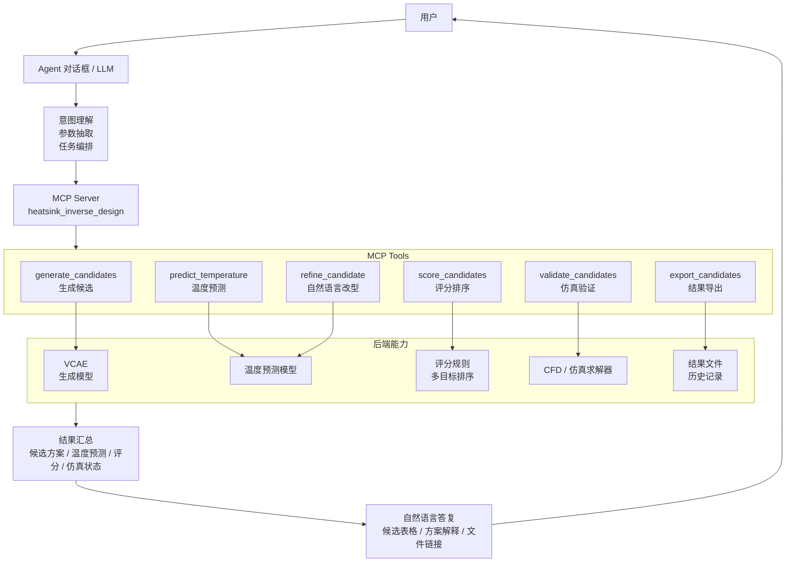
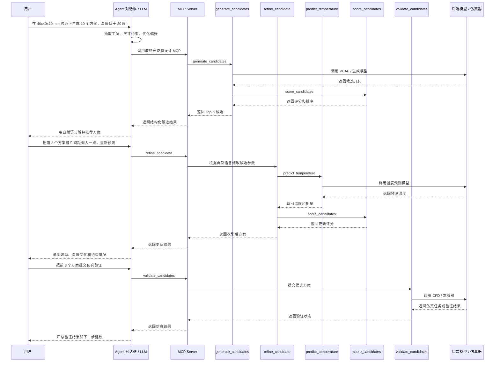

# MCP 封装分析

## 背景

`frontend/index.html` 展示了散热器逆向设计工作台的大致功能，包括工况输入、约束输入、优化偏好、Top-K 候选推荐、候选排序、几何调参、温度预测、评分展示、验证集整理以及 JSON/CSV 导出。

这个前端页面主要用于说明系统需要具备哪些业务能力。实际 MCP 封装目标不是为了让前端逐项调用，而是为了让用户在 Agent 对话框中通过自然语言调起这些能力。例如：

- 帮我在 40 x 40 x 20 mm 约束下生成 10 个散热器方案。
- 把第 3 个方案的鳍片间距调大一点，再重新预测温度。
- 按温度优先、压降其次，对这些方案重新排序。
- 把这几个候选方案提交仿真验证。
- 导出一份可用于仿真的输入文件。

因此 MCP 的封装边界应围绕“散热器逆向设计”这个业务域，而不是围绕前端按钮或页面区块。

## 推荐结论

建议封装 **1 个 MCP Server**，命名可为 `heatsink_inverse_design` 或 `heatsink_design_agent`。

继续保持一个 MCP 的原因是：候选生成、温度预测、方案评分、自然语言改型、仿真验证和结果导出都属于同一个连续设计流程。它们共享同一套工况、几何参数、候选方案结构和模型能力，拆成多个 MCP 会过早增加跨服务编排复杂度。

面向 Agent 对话框，建议提供 **4 到 6 个 tools**：

1. `generate_candidates`
2. `predict_temperature`
3. `score_candidates`
4. `refine_candidate`
5. `validate_candidates`
6. `export_candidates`

最小可用版本为 **1 个 MCP + 4 个 tools**：

1. `generate_candidates`
2. `predict_temperature`
3. `score_candidates`
4. `validate_candidates`

Agent 对话增强版为 **1 个 MCP + 6 个 tools**，额外加入 `refine_candidate` 和 `export_candidates`。

## Tool 设计

### generate_candidates

用于根据用户给出的工况、空间约束和优化偏好生成散热器候选方案。

输入：

- 外包络尺寸：`base_width`、`base_depth`、`total_height`
- 工况参数：`chip_length`、`Rjc`、`Rjb`、`power`、`wind_speed`
- 推理目标：`temp_limit`、`top_k`、`candidate_pool_size`
- 优化偏好：`optimization_priority`

输出：

- Top-K 候选方案
- 每个候选的几何尺寸
- 预测温度
- 温度裕量
- 模块评分
- 综合评分
- 排名信息

### predict_temperature

用于预测单个或多个散热器方案在给定工况下的温度表现。

输入：

- 单个或多个散热器几何方案
- 当前工况参数
- 温度上限

输出：

- `pred_cpu_temp`
- `temp_margin`
- `is_feasible`
- 可选的不确定性指标

这个 tool 适合在用户要求“修改某个尺寸后重新预测”时被 Agent 调用。

### score_candidates

用于对候选方案进行多目标评分和排序。

输入：

- 候选方案列表
- 工况参数
- 优化偏好及权重

输出：

- `thermal_score`
- `pressure_score`
- `surface_score`
- `cost_score`
- `final_score`
- 排序后的候选方案列表

该 tool 可以和 `predict_temperature` 合并，但单独保留更利于后续替换真实评分模型或多目标优化策略。

### refine_candidate

用于根据用户自然语言要求修改某个候选方案，并返回新的几何方案、预测结果和评分。

输入：

- 原始候选方案
- 用户修改意图，例如“鳍片薄一点”“间距稍微放大”“总高度不要超过 20 mm”
- 约束条件
- 工况参数

输出：

- 修改后的候选方案
- 被修改的参数列表
- 是否满足尺寸约束
- 更新后的预测温度和评分

这个 tool 是面向 Agent 对话框时建议新增的能力。因为用户通常不会像前端一样拖动滑块，而是直接用自然语言表达设计意图。

### validate_candidates

用于将候选方案提交到仿真或外部求解流程。

输入：

- 用户选中的推荐方案
- 用户自定义或改型后的候选方案
- 工况参数
- 温度上限

输出：

- 仿真任务 ID 或同步验证结果
- 每个候选的验证状态
- 仿真温度、压降等真实求解结果
- 与预测结果的误差

这是最应该后端化的能力，因为它通常会连接 CFD、有限元、外部求解器或排队任务系统。

### export_candidates

用于导出候选方案、验证集或仿真输入文件。

这是可选 tool。如果只是前端本地下载 JSON/CSV，可以不封装 MCP。如果希望 Agent 在对话中生成文件、仿真输入包、报告或审计记录，则建议保留。

输入：

- 候选方案列表或验证方案列表
- 导出格式：`json`、`csv`、`simulation_input`、`report`

输出：

- 文件内容
- 文件路径
- 下载链接
- 可选的报告摘要

## Agent 调用链



## 对话式调用示例



## API 封装关系

后端 AI 模型和仿真求解器建议封装为独立 API，再由 MCP Tools 调用。MCP 不建议直接深度耦合模型脚本、训练代码或 CFD 求解程序。

推荐分层如下：

```text
用户
  ↓
Agent 对话框 / LLM
  ↓
MCP Server
  ↓
MCP Tools
  ↓
后端 API
  ↓
AI 模型 / 仿真求解器 / 数据库
```

这样的职责边界更清晰：

- MCP：负责给 Agent 暴露稳定工具，并把自然语言任务转成结构化调用。
- 后端 API：负责业务服务边界、参数校验、任务编排、权限控制和错误处理。
- AI 模型：负责候选生成、温度预测或评分推理。
- 仿真求解器：负责 CFD、有限元或其他高成本验证任务。
- 数据库 / 文件系统：负责保存历史方案、仿真任务、结果文件和报告。

建议的 API 映射：

```text
MCP Tool: generate_candidates
  -> POST /api/candidates/generate
     -> 调用 VCAE / CVAE / Diffusion 生成模型

MCP Tool: predict_temperature
  -> POST /api/temperature/predict
     -> 调用温度预测模型

MCP Tool: score_candidates
  -> POST /api/candidates/score
     -> 调用评分规则或多目标排序模型

MCP Tool: refine_candidate
  -> POST /api/candidates/refine
     -> 根据自然语言约束修改候选方案，并重新预测和评分

MCP Tool: validate_candidates
  -> POST /api/simulation/jobs
     -> 创建 CFD / 仿真求解任务

MCP Tool: export_candidates
  -> POST /api/candidates/export
     -> 导出 JSON、CSV、仿真输入包或报告
```

仿真求解建议优先设计为异步 API：

```text
POST /api/simulation/jobs
  -> 返回 job_id

GET /api/simulation/jobs/{job_id}
  -> 查询 queued / running / succeeded / failed

GET /api/simulation/jobs/{job_id}/artifacts
  -> 获取仿真结果文件、日志或报告
```

原因是仿真通常耗时长、可能失败、需要排队，也需要保存中间文件和结果文件，不适合让 MCP Tool 长时间阻塞等待。

AI 模型推理如果很快，可以先做同步 API。若候选池较大、模型较重或需要 GPU 排队，也可以按异步任务处理。

最终建议是：**MCP 是 Agent 的工具层；后端 AI 模型和仿真求解器是业务能力层，应封装成独立 API，由 MCP Tools 调用。**

## 不建议封装为 MCP 的能力

以下能力属于前端或客户端交互逻辑，不应作为核心 MCP tool：

- 示例数据填充
- 表格排序切换
- 勾选、删除、恢复原值
- 自定义尺寸表单展开
- Canvas 散热器俯视图和侧视图绘制
- 纯本地状态管理

如果未来仍保留 Web 前端，这些能力可以留在前端。MCP 只负责可被 Agent 调用的稳定业务能力。

## 何时拆成多个 MCP

当前阶段不建议拆多个 MCP。只有当后续系统边界明显扩大时，再考虑拆分，例如：

- `heatsink_inverse_design`：负责候选生成、预测、评分、改型
- `simulation_solver`：负责 CFD、有限元、异步求解任务
- `experiment_database`：负责历史方案、实验记录和检索
- `report_generator`：负责报告、图表和归档文件生成

在当前阶段，一个领域 MCP 更利于 Agent 编排，也更容易维护 tool schema 的一致性。

## 实施优先级

第一阶段建议先实现：

1. `generate_candidates`
2. `predict_temperature`
3. `score_candidates`
4. `validate_candidates`

第二阶段再补充：

1. `refine_candidate`
2. `export_candidates`
3. 异步仿真任务查询
4. 模型版本管理
5. 历史设计记录
6. 批量实验对比

## 当前封装落地

当前 AI 推理与 Agent 目录按以下结构组织：

```text
AIHeatsinkInverseDesign/common/
AIHeatsinkInverseDesign/infer/
agent/app/api/heatsink_inference_api.py
agent/mcp/heatsink-inverse-design/server.py
agent/skills/heatsink-inverse-design/SKILL.md
agent/tools/heatsink_inverse_design/
agent/prompts/
```

其中：

- `AIHeatsinkInverseDesign/common` 存放推理公共代码，包括数据适配、模型定义、checkpoint 加载、评分排序和温度预测。
- `AIHeatsinkInverseDesign/infer` 存放三种生成式推理入口，包括 `cvae`、`threshold-cvae` 和 `diffusion`。
- `agent/app` 是可选 FastAPI 推理 API。
- `agent/mcp/heatsink-inverse-design/server.py` 是 FastMCP Server，负责给 Agent 暴露 tools。
- `agent/skills/heatsink-inverse-design/SKILL.md` 是 Agent 调用规程。
- `agent/tools/heatsink_inverse_design` 存放 6 个业务 tool 的具体实现。
- `agent/prompts` 存放可复用提示词和远端 tool contract。
- `agent/heatsink_mcp_server.py` 仅保留为兼容入口，内部转到新的 `agent/mcp/heatsink-inverse-design/server.py`。

AI 推理服务优先使用 `threshold-cvae`，也就是 `AIHeatsinkInverseDesign/infer/guided_cvae_inferencer.py` 推理路径。该路径会调用：

```text
AIHeatsinkInverseDesign/infer/cvae_inferencer.py
AIHeatsinkInverseDesign/common/heatsink_inverse_common.py
AIHeatsinkInverseDesign/common/data_adapter.py
AIHeatsinkInverseDesign/common/models.py
```

当前 FastMCP 暴露的 tools：

1. `generate_candidates`：生成推荐，对应 `agent/tools/heatsink_inverse_design/generate_candidates.py`
2. `predict_temperature`：尺寸调参与温度预测，对应 `agent/tools/heatsink_inverse_design/predict_temperature.py`
3. `score_candidates`：模块评分条和综合排序，对应 `agent/tools/heatsink_inverse_design/score_candidates.py`
4. `refine_candidate`：用户修改意图，对应 `agent/tools/heatsink_inverse_design/refine_candidate.py`
5. `validate_candidates`：提交仿真求解，对应 `agent/tools/heatsink_inverse_design/validate_candidates.py`
6. `export_candidates`：导出 JSON / CSV / 验证集，对应 `agent/tools/heatsink_inverse_design/export_candidates.py`

其中生成、预测、评分、改型和导出这 5 个 tools 支持 `route` 参数：

```text
route="api"    默认值，调用 FastAPI 推理服务
route="local"  直接调用 AIHeatsinkInverseDesign 本地推理源码
```

也就是说，MCP 仍然只暴露 6 个业务 tools，不额外暴露 `*_local` tools。调用方通过同一个 tool 的 `route` 字段选择实现方式。

推荐理解为“一套业务工具，两种执行路由”：

| 场景 | 调用方式 | 说明 |
| --- | --- | --- |
| `route="api"` | MCP tool -> FastAPI -> 推理源码 | 更接近真实业务部署，FastAPI 负责模型加载和推理服务化。 |
| `route="local"` | MCP tool -> 本地推理源码 | 适合本机调试或不想启动 FastAPI 时直接验证推理脚本。 |

因此 Inspector / OpenCode 里看到的 tools 数量仍应是 6 个。需要切换实现方式时，只在对应 tool 的请求 JSON 中增加或修改 `route` 字段即可。

本地源码直调的共享适配层位于：

```text
agent/tools/heatsink_inverse_design/local_inference.py
```

依赖清单位于：

```text
agent/requirements.txt
```

MCP 客户端配置示例位于：

```text
agent/mcp_config.example.json
```

FastAPI 推理服务环境变量示例位于：

```text
agent/app/api_config.example.env
```

同时配套新增 Skill：

```text
agent/skills/heatsink-inverse-design/SKILL.md
```

该 Skill 的作用不是执行推理，而是指导 Agent 在对话中如何使用 MCP：

- 从用户自然语言中抽取工况、外包络、温度阈值和 Top-K。
- 信息缺失时只追问必要参数。
- 新方案生成时调用 `generate_candidates`。
- 修改方案时调用 `refine_candidate` 或 `predict_temperature`。
- 比较或排序时调用 `score_candidates`。
- 仿真验证时调用 `validate_candidates`。
- 导出结果时调用 `export_candidates`。

也就是说，**MCP 给 Agent 提供可执行工具，Skill 给 Agent 提供调用规程**。

## 业务推理 API 封装

除 MCP tools 之外，当前根目录的 `main.py` 还封装了两个面向业务系统或 Postman 验证的 HTTP API：

```text
POST /recommendSize
POST /predictTemperature
```

同时也保留了语义更清晰的路径别名：

```text
POST /heatsink/recommend-size
POST /heatsink/predict-temperature
```

这两个接口不是直接调用 MCP tool，也不依赖 Agent Skill；同时也不再绕行 `agent/app/api/heatsink_inference_api.py`。调用链是：

```text
Postman / 业务系统
  -> main.py:8080
  -> infer/cvae_inferencer.py
  -> common/heatsink_inverse_common.py
  -> threshold-CVAE checkpoint
```

其中：

- `main.py` 是业务系统入口，对外暴露统一 HTTP API。
- `recommendSize` 直接调用 `infer/cvae_inferencer.py` 中的 `generate_rows` 生成推荐尺寸。
- `predictTemperature` 直接调用 `common/heatsink_inverse_common.py` 中的 `load_checkpoint` 和 `score_candidates` 预测温度。
- `main.py` 会自动兼容两种源码目录：`main.py` 同级的 `codex`，以及部署布局中的 `AI_Heatsink_Generation/scripts/codex`。
- `HEATSINK_THRESHOLD_CVAE_CHECKPOINT` 用来指定 threshold-CVAE checkpoint。
- `HEATSINK_API_DEVICE` 用来指定推理设备，默认 `cpu`。

业务 API 启动脚本只需要保留启动 `main.py`：

```cmd
cd /d D:\ZhouWJ\InverseDesign
python main.py
```

`main.py` 会启动业务 API，默认监听：

```text
http://127.0.0.1:8080
```

推荐尺寸和温度预测由 `main.py` 进程直接加载源码和 checkpoint 执行，不需要再单独启动 `agent/app/api/heatsink_inference_api.py`。

`main.py` 中已经内置默认配置：

```text
HEATSINK_THRESHOLD_CVAE_CHECKPOINT=infer/outputs_guided_cvae/heatsink/best_model.pt
HEATSINK_API_DEVICE=cpu
```

因此本地验证时不需要再在 cmd 中执行 `set HEATSINK_THRESHOLD_CVAE_CHECKPOINT=...` 或 `set HEATSINK_API_DEVICE=...`。如果某次请求需要临时指定模型或设备，可以在 Postman Body 中传入 `checkpoint_path` 或 `device` 字段覆盖默认值。

### Postman 测试：推荐尺寸

Postman 配置：

```text
Method: POST
URL: http://127.0.0.1:8080/recommendSize
Headers:
Content-Type: application/json
```

Body 选择 `raw` + `JSON`：

```json
{
  "request": {
    "condition": {
      "chip_length": 35,
      "Rjc": 0.6,
      "Rjb": 1.1,
      "power": 85,
      "wind_speed": 4
    },
    "bbox": {
      "base_width": 40,
      "base_depth": 40,
      "total_height": 20
    },
    "temp_threshold": 80,
    "top_k": 5,
    "candidate_pool_size": 64
  },
  "device": "cpu",
  "candidate_pool_size": 64,
  "top_k": 5
}
```

预期返回字段包括：

```json
{
  "method": "threshold-cvae",
  "checkpoint_path": "...best_model.pt",
  "device": "cpu",
  "candidate_pool_size": 64,
  "top_k": 5,
  "temp_threshold": 80,
  "candidates": []
}
```

真实运行时，`candidates` 应返回候选尺寸列表，每个候选包含预测温度、温度裕量、是否满足阈值以及几何尺寸。

### Postman 测试：温度预测

Postman 配置：

```text
Method: POST
URL: http://127.0.0.1:8080/predictTemperature
Headers:
Content-Type: application/json
```

Body 选择 `raw` + `JSON`：

```json
{
  "request": {
    "condition": {
      "chip_length": 35,
      "Rjc": 0.6,
      "Rjb": 1.1,
      "power": 85,
      "wind_speed": 4
    },
    "bbox": {
      "base_width": 40,
      "base_depth": 40,
      "total_height": 20
    },
    "temp_threshold": 80,
    "top_k": 5,
    "candidate_pool_size": 64
  },
  "geometry": {
    "base_width": 40,
    "base_depth": 40,
    "total_height": 20,
    "base_height": 2.5,
    "fin_height": 17.5,
    "fin_thickness": 1.2,
    "fin_clear_spacing": 3.0,
    "fin_break_thickness": 1.5,
    "fin_break_width": 2.0
  },
  "device": "cpu"
}
```

预期返回字段类似：

```json
{
  "rank": 1,
  "pred_cpu_temp": 78.5,
  "temp_threshold": 80,
  "threshold_ok": true,
  "temp_margin": 1.5,
  "is_feasible": true
}
```

注意：几何字段使用 `fin_clear_spacing`，不是 `fin_spacing`。

### Linux 本地 curl 测试

如果本地环境是 Linux，无法使用 Postman，可以用 `curl` 验证 `main.py` 的业务 API。该测试只验证 `main.py -> codex` 的 API 封装链路，不涉及 `AIHeatsinkInverseDesign`。

进入 `main.py` 所在目录：

```bash
cd /path/to/main.py所在目录
```

确认部署源码目录存在：

```bash
ls ./AI_Heatsink_Generation/scripts/infer/cvae_inferencer.py
ls ./AI_Heatsink_Generation/scripts/common/heatsink_inverse_common.py
```

安装运行依赖：

```bash
pip install fastapi uvicorn torch numpy pydantic
```

启动服务：

```bash
python main.py
```

健康检查：

```bash
curl http://127.0.0.1:8080/health
```

推荐尺寸：

```bash
curl -X POST http://127.0.0.1:8080/recommendSize \
  -H "Content-Type: application/json" \
  -d '{
    "request": {
      "condition": {
        "chip_length": 35,
        "Rjc": 0.6,
        "Rjb": 1.1,
        "power": 85,
        "wind_speed": 4
      },
      "bbox": {
        "base_width": 40,
        "base_depth": 40,
        "total_height": 20
      },
      "temp_threshold": 80,
      "top_k": 5,
      "candidate_pool_size": 64
    },
    "device": "cpu",
    "candidate_pool_size": 64,
    "top_k": 5
  }'
```

温度预测：

```bash
curl -X POST http://127.0.0.1:8080/predictTemperature \
  -H "Content-Type: application/json" \
  -d '{
    "request": {
      "condition": {
        "chip_length": 35,
        "Rjc": 0.6,
        "Rjb": 1.1,
        "power": 85,
        "wind_speed": 4
      },
      "bbox": {
        "base_width": 40,
        "base_depth": 40,
        "total_height": 20
      },
      "temp_threshold": 80,
      "top_k": 5,
      "candidate_pool_size": 64
    },
    "geometry": {
      "base_width": 40,
      "base_depth": 40,
      "total_height": 20,
      "base_height": 2.5,
      "fin_height": 17.5,
      "fin_thickness": 1.2,
      "fin_clear_spacing": 3.0,
      "fin_break_thickness": 1.5,
      "fin_break_width": 2.0
    },
    "device": "cpu"
  }'
```

如果 checkpoint 不在默认路径，可在请求体顶层增加：

```json
"checkpoint_path": "/absolute/path/to/best_model.pt"
```

常见错误：

- `No module named cvae_inferencer`：确认 `AI_Heatsink_Generation/scripts/codex` 在 `main.py` 所在目录下。
- `No module named fastapi`：当前 Python 环境缺少 Web 服务依赖，执行 `pip install fastapi uvicorn`。
- `No module named torch`：当前 Python 环境缺少 PyTorch。
- `best_model.pt` 找不到：把 checkpoint 放到默认路径，或在请求体中传入 `checkpoint_path`。

核心依赖包括：

```text
Python 3.10+
mcp
fastapi
uvicorn
pydantic
torch
numpy
PyYAML
```

运行前需要准备 threshold-CVAE checkpoint。默认路径为：

```text
infer/outputs_guided_cvae/heatsink/best_model.pt
```

也可以通过环境变量指定：

```text
HEATSINK_THRESHOLD_CVAE_CHECKPOINT=D:\path\to\best_model.pt
```

设备默认使用 CPU，也可以通过环境变量指定：

```text
HEATSINK_API_DEVICE=cuda
```

本地启动示例需要先启动 FastAPI 推理服务。cmd 示例：

```cmd
cd /d D:\ZhouWJ\InverseDesign\Heatsink\VCAE
pip install -r agent\requirements.txt
set HEATSINK_THRESHOLD_CVAE_CHECKPOINT=D:\path\to\outputs_guided_cvae\heatsink\best_model.pt
set HEATSINK_API_DEVICE=cpu
uvicorn agent.app.api.heatsink_inference_api:app --host 127.0.0.1 --port 8000
```

然后由 Agent 客户端启动 MCP Server，或手动启动：

```cmd
cd /d D:\ZhouWJ\InverseDesign\Heatsink\VCAE
set HEATSINK_INFERENCE_API_URL=http://127.0.0.1:8000
python agent\mcp\heatsink-inverse-design\server.py
```

如果由 Agent 客户端加载 MCP，可配置命令为：

```text
python D:\ZhouWJ\InverseDesign\hdp-neural-solver\agent\mcp\heatsink-inverse-design\server.py
```

MCP Server 默认调用：

```text
HEATSINK_INFERENCE_API_URL=http://127.0.0.1:8000
```

### Remote MCP 模拟真实业务场景

为了模拟真实业务场景，推荐使用 remote MCP。此时 OpenCode 不再启动本地 stdio MCP 进程，而是通过 URL 连接一个已经运行的 MCP HTTP 服务。

完整链路为：

```text
OpenCode
  -> remote MCP: http://127.0.0.1:9000
  -> FastMCP HTTP Server
  -> FastAPI: http://127.0.0.1:8000
  -> threshold-CVAE checkpoint
```

cmd 窗口 1：启动 FastAPI 推理服务。

```cmd
cd /d D:\ZhouWJ\InverseDesign\Heatsink\VCAE
set HEATSINK_THRESHOLD_CVAE_CHECKPOINT=D:\path\to\outputs_guided_cvae\heatsink\best_model.pt
set HEATSINK_API_DEVICE=cpu
python agent\app\run_api.py
```

cmd 窗口 2：启动 remote MCP Server。

当前项目使用的是 `mcp` Python SDK。`remote_server.py` 会先设置 `mcp.settings.host`、`mcp.settings.port`、`mcp.settings.streamable_http_path`，再调用：

```python
mcp.run(transport="streamable-http")
```

```cmd
cd /d D:\ZhouWJ\InverseDesign\Heatsink\VCAE
set HEATSINK_INFERENCE_API_URL=http://127.0.0.1:8000
python agent\mcp\heatsink-inverse-design\remote_server.py --host 127.0.0.1 --port 9000 --path /
```

cmd 窗口 3：启动 OpenCode。

```cmd
cd /d D:\ZhouWJ\InverseDesign\Heatsink\VCAE
opencode
```

此时 `opencode.json` 中使用的是 remote MCP：

```json
{
  "mcp": {
    "heatsink_inverse_design": {
      "type": "remote",
      "url": "http://127.0.0.1:9000",
      "enabled": true
    }
  }
}
```

注意：`http://127.0.0.1:8000` 是 FastAPI 业务 API 地址，不是 MCP 地址；`http://127.0.0.1:9000` 才是 OpenCode 连接的 remote MCP 地址。

## OpenCode 使用步骤

当前仓库根目录已提供 OpenCode 配置：

```text
opencode.json
```

其中 `heatsink_inverse_design` 被配置为 remote MCP：

```json
{
  "mcp": {
    "heatsink_inverse_design": {
      "type": "remote",
      "url": "http://127.0.0.1:9000",
      "enabled": true,
      "timeout": 10000
    }
  }
}
```

在 OpenCode 中测试前，需要按顺序启动三个 cmd 窗口。

cmd 窗口 1：启动 FastAPI 推理服务。

```cmd
cd /d D:\ZhouWJ\InverseDesign\Heatsink\VCAE
set HEATSINK_THRESHOLD_CVAE_CHECKPOINT=D:\path\to\outputs_guided_cvae\heatsink\best_model.pt
set HEATSINK_API_DEVICE=cpu
python agent\app\run_api.py
```

cmd 窗口 2：启动 remote MCP Server。

```cmd
cd /d D:\ZhouWJ\InverseDesign\Heatsink\VCAE
set HEATSINK_INFERENCE_API_URL=http://127.0.0.1:8000
python agent\mcp\heatsink-inverse-design\remote_server.py --host 127.0.0.1 --port 9000 --path /
```

cmd 窗口 3：启动 OpenCode。

```cmd
cd /d D:\ZhouWJ\InverseDesign\Heatsink\VCAE
opencode
```

OpenCode 启动后，可以先用不依赖 checkpoint 的自然语言请求测试 MCP 是否连通：

```text
使用 heatsink_inverse_design MCP，测试 validate_candidates：
工况为 chip_length=35, Rjc=0.6, Rjb=1.1, power=85, wind_speed=4；
外包络为 40 x 40 x 20 mm；
温度阈值 80 degC；
candidates 为空数组。
```

预期行为：

- OpenCode 能识别并调用 `validate_candidates`。
- 返回 `status: not_submitted`。
- 明确说明当前只是准备仿真 payload，没有提交真实 CFD。

然后测试真实 threshold-CVAE 推理：

```text
使用散热器逆向设计能力：在 40 x 40 x 20 mm 空间约束下，
芯片长度 35 mm，Rjc=0.6 degC/W，Rjb=1.1 degC/W，
功率 85 W，风速 4 m/s，温度阈值 80 degC，
生成 5 个散热器候选方案。
```

预期行为：

- OpenCode 根据 Skill 抽取 `condition`、`bbox`、`temp_threshold`、`top_k`。
- 调用 `generate_candidates`。
- 返回候选方案表格，包含预测温度、温度裕量、可行性和几何参数。

继续测试多轮上下文：

```text
把第 1 个候选方案的鳍片间距调大一点，同时保持总高度 20 mm 不变，再预测温度变化。
```

预期行为：

- OpenCode 复用上一轮第 1 个候选方案。
- 调用 `refine_candidate`。
- 返回参数变化、更新后的温度和约束是否满足。

如果 OpenCode 没有发现 MCP：

1. 确认 `opencode.json` 位于 `D:\ZhouWJ\InverseDesign\Heatsink\VCAE` 根目录。
2. 确认 remote MCP Server 正在监听 `http://127.0.0.1:9000`。
3. 确认 OpenCode 是从同一个项目根目录启动的。
4. 确认 FastAPI 服务已启动在 `http://127.0.0.1:8000`。
5. 确认 `HEATSINK_INFERENCE_API_URL` 在启动 remote MCP 的 cmd 窗口中已设置。

## 给同事共享 remote MCP URL

如果同事只想试用 MCP，不想拿源码和配置模型环境，可以在你的机器上运行 FastAPI 和 remote MCP，然后把 MCP URL 发给同事。

### 局域网共享

适用场景：你和同事在同一个内网、同一 Wi-Fi 或公司 VPN 中。

步骤 1：查看你电脑的局域网 IP。

```cmd
ipconfig
```

找到类似：

```text
IPv4 Address . . . . . . . . . . . : 192.168.1.23
```

下面用 `192.168.1.23` 作为示例。

步骤 2：启动 FastAPI 推理服务。FastAPI 只需要被本机 MCP 调用，因此可以继续监听本机地址。

```cmd
cd /d D:\ZhouWJ\InverseDesign\Heatsink\VCAE
set HEATSINK_THRESHOLD_CVAE_CHECKPOINT=D:\path\to\outputs_guided_cvae\heatsink\best_model.pt
set HEATSINK_API_DEVICE=cpu
python agent\app\run_api.py
```

步骤 3：启动 remote MCP，并监听所有网卡。

```cmd
cd /d D:\ZhouWJ\InverseDesign\Heatsink\VCAE
set HEATSINK_INFERENCE_API_URL=http://127.0.0.1:8000
python agent\mcp\heatsink-inverse-design\remote_server.py --host 0.0.0.0 --port 9000 --path / --disable-host-check
```

步骤 4：确认 Windows 防火墙允许同事访问 9000 端口。

如果同事无法访问，先在你的机器上允许 Python 通过防火墙，或开放 TCP 9000 端口。只建议在可信内网中这样做。

步骤 5：把这个 URL 发给同事。

```text
http://192.168.1.23:9000
```

同事在 OpenCode 的 `opencode.json` 中配置：

```json
{
  "$schema": "https://opencode.ai/config.json",
  "mcp": {
    "heatsink_inverse_design": {
      "type": "remote",
      "url": "http://192.168.1.23:9000",
      "enabled": true,
      "timeout": 10000
    }
  }
}
```

同事启动 OpenCode 后即可通过 remote MCP 调用你机器上的推理能力。同事不需要 checkpoint，也不需要安装 torch 或 FastAPI。

### 同事侧 Skill / Prompt 配置

remote MCP 只会把 tools 暴露给同事的 Agent，不会把你本地的 Skill、Prompt 或项目文档一起传过去。

也就是说，同事可以看到并调用：

```text
generate_candidates
predict_temperature
score_candidates
refine_candidate
validate_candidates
export_candidates
```

但同事的 Agent 不会自动读取你本地的：

```text
agent/skills/heatsink-inverse-design/SKILL.md
agent/prompts/heatsink-inverse-design.md
agent/prompts/heatsink-agent-test-cases.md
```

因此，同事只配置 remote MCP 时，Agent 可能只知道“有这些工具”，但不知道业务调用规程，例如：

- 什么时候应该生成候选方案，什么时候应该预测温度。
- 如何从自然语言中组织 `condition`、`bbox`、`temp_threshold`、`top_k`。
- 多轮对话中如何复用上一轮候选方案。
- `validate_candidates` 在没有真实仿真 API 时只返回待提交 payload，不能声称已经完成 CFD。

推荐做法是：你这边只部署 FastAPI 和 remote MCP；同事本地额外放一份轻量 Skill / Prompt 说明文件，并在 OpenCode 的 `instructions` 中引用它。

同事侧最小 `opencode.json` 示例：

```json
{
  "$schema": "https://opencode.ai/config.json",
  "mcp": {
    "heatsink_inverse_design": {
      "type": "remote",
      "url": "http://你的IP或穿刺域名:9000",
      "enabled": true,
      "timeout": 10000
    }
  },
  "instructions": [
    "heatsink-inverse-design.md"
  ]
}
```

如果不想把源码发给同事，只需要给同事一份精简版 `heatsink-inverse-design.md`。这份文件应说明 6 个 tools 的用途、必填参数、典型调用顺序、温度阈值含义、仿真验证限制和导出格式即可，不需要包含 checkpoint、模型代码或 FastAPI 源码。

当前已整理一份可直接给远端调用侧 Agent 使用的完整 tool contract：

```text
agent/prompts/remote-mcp-tool-contract.md
```

这份文档明确要求远端部署下调用 `generate_candidates`、`predict_temperature`、`score_candidates`、`refine_candidate`、`export_candidates` 时显式传入 `route: "local"`，并逐一列出了 6 个 tools 的输入字段、输出字段和 JSON 调用示例。

### 公网或跨网络共享

如果不在同一个内网，可以用隧道工具把你的 9000 端口暴露出去，例如：

- `ngrok`
- `cloudflared tunnel`
- `frp`
- 公司 VPN / 跳板机

以 ngrok 为例：

```cmd
ngrok http 9000
```

假设得到：

```text
https://xxxx.ngrok-free.app
```

同事的 OpenCode 配置为：

```json
{
  "$schema": "https://opencode.ai/config.json",
  "mcp": {
    "heatsink_inverse_design": {
      "type": "remote",
      "url": "https://xxxx.ngrok-free.app",
      "enabled": true,
      "timeout": 10000
    }
  }
}
```

### 安全注意事项

当前 remote MCP 没有鉴权。共享给同事测试时建议：

- 只在可信内网或临时隧道中使用。
- 不要长期暴露到公网。
- 不要把 URL 发给无关人员。
- 测试结束后关闭 remote MCP 进程。
- 如果要长期给多人使用，应增加 token 鉴权、HTTPS、IP 白名单、日志和限流。

## MCP Inspector 测试步骤

可以用 MCP Inspector 测试当前 FastMCP Server。完整链路是：

```text
MCP Inspector -> FastMCP Server -> FastAPI -> threshold-CVAE checkpoint
```

### Streamable HTTP 模式

如果要模拟 remote MCP，请使用 Streamable HTTP 模式测试。完整链路是：

```text
MCP Inspector
  -> Streamable HTTP: http://127.0.0.1:9000
  -> FastMCP remote_server.py
  -> FastAPI: http://127.0.0.1:8000
  -> threshold-CVAE checkpoint
```

cmd 窗口 1：启动 FastAPI 推理服务。

```cmd
cd /d D:\ZhouWJ\InverseDesign\Heatsink\VCAE
set HEATSINK_THRESHOLD_CVAE_CHECKPOINT=D:\path\to\outputs_guided_cvae\heatsink\best_model.pt
set HEATSINK_API_DEVICE=cpu
python agent\app\run_api.py
```

cmd 窗口 2：启动 remote MCP Server。

```cmd
cd /d D:\ZhouWJ\InverseDesign\Heatsink\VCAE
set HEATSINK_INFERENCE_API_URL=http://127.0.0.1:8000
python agent\mcp\heatsink-inverse-design\remote_server.py --host 127.0.0.1 --port 9000 --path /
```

cmd 窗口 3：启动 MCP Inspector。

```cmd
npx @modelcontextprotocol/inspector
```

Inspector 页面设置：

```text
Transport: Streamable HTTP
URL: http://127.0.0.1:9000
```

然后点击 `Connect`。连接成功后进入 `Tools`，应该看到：

```text
generate_candidates
predict_temperature
score_candidates
refine_candidate
validate_candidates
export_candidates
```

注意：`http://127.0.0.1:8000` 是 FastAPI 业务 API 地址，不要填到 Inspector 的 MCP URL 中。Inspector 的 URL 应该填 `http://127.0.0.1:9000`。

### stdio 模式

如果只是本地快速验证 MCP 进程，也可以使用 stdio 模式。

使用 cmd 时建议开两个窗口。

cmd 窗口 1：启动 FastAPI 推理服务。

```cmd
cd /d D:\ZhouWJ\InverseDesign\Heatsink\VCAE
pip install -r agent\requirements.txt
set HEATSINK_THRESHOLD_CVAE_CHECKPOINT=D:\path\to\outputs_guided_cvae\heatsink\best_model.pt
set HEATSINK_API_DEVICE=cpu
uvicorn agent.app.api.heatsink_inference_api:app --host 127.0.0.1 --port 8000
```

如果 cmd 报 `No module named agent`，通常是没有在 `VCAE` 根目录执行。可以改用更稳的启动入口：

```cmd
cd /d D:\ZhouWJ\InverseDesign\Heatsink\VCAE
set HEATSINK_THRESHOLD_CVAE_CHECKPOINT=D:\path\to\outputs_guided_cvae\heatsink\best_model.pt
set HEATSINK_API_DEVICE=cpu
python agent\app\run_api.py
```

如果报 `No module named fastapi`、`No module named uvicorn` 或 `No module named pydantic`，说明依赖没装到当前 Python 环境：

```cmd
pip install -r agent\requirements.txt
```

cmd 窗口 2：启动 MCP Inspector。

```cmd
cd /d D:\ZhouWJ\InverseDesign\Heatsink\VCAE
set HEATSINK_INFERENCE_API_URL=http://127.0.0.1:8000
npx @modelcontextprotocol/inspector python agent\mcp\heatsink-inverse-design\server.py
```

注意：cmd 中的 `set` 只对当前窗口有效，所以两个窗口都需要设置各自用到的环境变量。

Inspector 中应该能看到 6 个 tools：

```text
generate_candidates
predict_temperature
score_candidates
refine_candidate
validate_candidates
export_candidates
```

Inspector 右侧会按字段要求填写参数。不要把下面所有字段再包成一个大 JSON；每个输入框填对应字段的 JSON 值。

### 1. 测试 `validate_candidates`

用途：提交仿真求解。  
依赖：不依赖 FastAPI，不依赖 checkpoint。建议第一个测试。

`request`：

```json
{
  "condition": {
    "chip_length": 35,
    "Rjc": 0.6,
    "Rjb": 1.1,
    "power": 85,
    "wind_speed": 4
  },
  "bbox": {
    "base_width": 40,
    "base_depth": 40,
    "total_height": 20
  },
  "temp_threshold": 80,
  "top_k": 5,
  "candidate_pool_size": 256
}
```

`candidates`：

```json
[]
```

`simulation_api_url`：留空。  
`timeout_seconds`：

```json
10
```

预期：返回 `status: not_submitted`，并返回待提交仿真的 payload。

### 2. 测试 `export_candidates`

用途：导出 JSON / CSV / 验证集。  
依赖：依赖 FastAPI，但不依赖 checkpoint。

`candidates`：

```json
[
  {
    "rank": 1,
    "pred_cpu_temp": 78.5,
    "temp_threshold": 80,
    "threshold_ok": true,
    "base_width": 40,
    "base_depth": 40,
    "total_height": 20,
    "base_height": 2.5,
    "fin_height": 17.5,
    "fin_thickness": 1.2,
    "fin_clear_spacing": 3.0,
    "fin_break_thickness": 1.5,
    "fin_break_width": 2.0
  }
]
```

`export_format`：

```json
"json"
```

`api_base_url`：

```json
"http://127.0.0.1:8000"
```

预期：返回 `filename` 和 `content`。如果 `export_format` 改为 `"csv"`，返回 CSV 文本。

### 3. 测试 `generate_candidates`

用途：生成推荐。  
依赖：依赖 FastAPI 和 threshold-CVAE checkpoint。

`request`：

```json
{
  "condition": {
    "chip_length": 35,
    "Rjc": 0.6,
    "Rjb": 1.1,
    "power": 85,
    "wind_speed": 4
  },
  "bbox": {
    "base_width": 40,
    "base_depth": 40,
    "total_height": 20
  },
  "temp_threshold": 80,
  "top_k": 5,
  "candidate_pool_size": 64
}
```

`checkpoint_path`：留空，使用环境变量或默认路径。  
`device`：

```json
"cpu"
```

`candidate_pool_size`：

```json
64
```

`top_k`：

```json
5
```

`latent_opt_steps`：

```json
40
```

`latent_lr`：

```json
0.05
```

`temperature_weight`：

```json
1.0
```

`threshold_weight`：

```json
2.0
```

`api_base_url`：

```json
"http://127.0.0.1:8000"
```

预期：返回 `candidates` 列表。后续测试可以从这里复制一个候选方案。

### 4. 测试 `predict_temperature`

用途：尺寸调参与温度预测。  
依赖：依赖 FastAPI 和 checkpoint。

`request`：使用 `generate_candidates` 中同一个 request。  

`geometry`：

```json
{
  "base_width": 40,
  "base_depth": 40,
  "total_height": 20,
  "base_height": 2.5,
  "fin_height": 17.5,
  "fin_thickness": 1.2,
  "fin_clear_spacing": 3.0,
  "fin_break_thickness": 1.5,
  "fin_break_width": 2.0
}
```

`checkpoint_path`：留空。  
`device`：

```json
"cpu"
```

`api_base_url`：

```json
"http://127.0.0.1:8000"
```

预期：返回 `pred_cpu_temp`、`temp_margin`、`threshold_ok` 或 `is_feasible`。

### 5. 测试 `score_candidates`

用途：模块评分条和综合排序。  
依赖：依赖 FastAPI 和 checkpoint。

`request`：使用 `generate_candidates` 中同一个 request。  

`candidates`：

```json
[
  {
    "base_width": 40,
    "base_depth": 40,
    "total_height": 20,
    "base_height": 2.5,
    "fin_height": 17.5,
    "fin_thickness": 1.2,
    "fin_clear_spacing": 3.0,
    "fin_break_thickness": 1.5,
    "fin_break_width": 2.0
  },
  {
    "base_width": 40,
    "base_depth": 40,
    "total_height": 20,
    "base_height": 2.2,
    "fin_height": 17.8,
    "fin_thickness": 1.1,
    "fin_clear_spacing": 3.4,
    "fin_break_thickness": 1.6,
    "fin_break_width": 2.1
  }
]
```

`checkpoint_path`：留空。  
`device`：

```json
"cpu"
```

`top_k`：

```json
2
```

`api_base_url`：

```json
"http://127.0.0.1:8000"
```

预期：返回排序后的 `candidates`，包含预测温度和阈值可行性。

### 6. 测试 `refine_candidate`

用途：用户修改意图。  
依赖：依赖 FastAPI 和 checkpoint。

`request`：使用 `generate_candidates` 中同一个 request。  

`candidate`：

```json
{
  "base_width": 40,
  "base_depth": 40,
  "total_height": 20,
  "base_height": 2.5,
  "fin_height": 17.5,
  "fin_thickness": 1.2,
  "fin_clear_spacing": 3.0,
  "fin_break_thickness": 1.5,
  "fin_break_width": 2.0
}
```

`updates` 可以留空，或者填：

```json
{
  "fin_clear_spacing": 3.4
}
```

`instruction`：

```json
"把鳍片间距调大一点"
```

`checkpoint_path`：留空。  
`device`：

```json
"cpu"
```

`api_base_url`：

```json
"http://127.0.0.1:8000"
```

预期：返回 `changes` 和改型后的 `candidate`，并重新预测温度。

其中 `validate_candidates` 当前支持两种模式：

- 未传入 `simulation_api_url`：只返回将要提交给仿真服务的结构化 payload。
- 传入 `simulation_api_url`：通过 HTTP POST 将候选方案提交给后端仿真 API。

因此后续接入 CFD 或其他仿真求解器时，只需要实现仿真 API，不需要改 Agent 的上层调用方式。

## 真实 Agent 场景测试

MCP Inspector 只能验证 tool 注册、参数传递和接口连通。真实 Agent 测试还需要验证：

- Agent 是否会从自然语言中抽取 `condition`、`bbox`、`temp_threshold`、`top_k`。
- Agent 是否会根据任务选择正确 tool。
- Agent 是否会复用上一轮生成的候选方案。
- Agent 是否会解释温度裕量、可行性和几何变化。
- Agent 是否不会在没有仿真 API 时声称完成真实 CFD。

真实 Agent 测试前置条件：

1. FastAPI 推理服务已启动。
2. MCP Server 已配置到 Agent 客户端。
3. `heatsink-inverse-design` Skill 已安装或被 Agent 客户端加载。
4. Agent 能看到 `heatsink_inverse_design` MCP Server 暴露的 6 个 tools。

推荐使用以下测试用例文件：

```text
agent/prompts/heatsink-agent-test-cases.md
```

真实 Agent 测试顺序：

1. 使用自然语言生成候选方案，观察是否调用 `generate_candidates`。
2. 让 Agent 基于“第 1 个候选方案”重新预测温度，观察是否调用 `predict_temperature` 并复用上下文。
3. 让 Agent 按“鳍片间距调大一点”改型，观察是否调用 `refine_candidate`。
4. 让 Agent 对当前候选重新排序，观察是否调用 `score_candidates`。
5. 让 Agent 提交前三个方案仿真验证，观察是否调用 `validate_candidates`，且没有仿真 API 时只返回 payload。
6. 让 Agent 导出 CSV，观察是否调用 `export_candidates`。

判定通过标准：

- Agent 使用自然语言也能触发正确 MCP tool。
- tool 参数中包含正确工况、外包络和温度阈值。
- 多轮对话中能引用上一轮候选方案。
- 输出包含候选表格、预测温度、温度裕量和可行性说明。
- 没有真实仿真结果时，Agent 明确说明只是准备验证 payload。

## Remote MCP Troubleshooting

远程共享时推荐继续使用 Streamable HTTP 地址：

```text
http://你的IP或穿刺域名:9000
```

这里把 MCP Streamable HTTP 直接挂到根路径 `/`，是为了兼容会丢失 URL path 的 Agent 客户端或穿刺代理。FastAPI 仍然是 `http://127.0.0.1:8000`，只给本机 MCP Server 调用。

远程启动 MCP Server 时建议使用：

```cmd
python agent\mcp\heatsink-inverse-design\remote_server.py --host 0.0.0.0 --port 9000 --path / --disable-host-check
```

如果 MCP 窗口出现：

```text
GET / HTTP/1.1 421 Misdirected Request
```

通常说明同事或穿刺工具已经访问到 MCP 服务，但请求里的 `Host` 不是 SDK 默认允许的 `127.0.0.1` / `localhost`。远程测试时需要加 `--disable-host-check`。

如果 MCP 窗口出现：

```text
GET /sse HTTP/1.1 404 Not Found
```

通常表示客户端或探测器在尝试旧的 SSE 入口。当前服务使用 Streamable HTTP，不走 `/sse`，这个日志本身不代表 MCP 不可用。

如果 MCP 窗口出现：

```text
POST / HTTP/1.1 404 Not Found
```

说明服务端实际启动路径不是 `/`，或者同事连到的不是这个 MCP 进程。确认启动命令中有 `--path /`，OpenCode URL 也完整写成 `http://你的IP或穿刺域名:9000`。

如果 FastAPI 窗口出现：

```text
POST / HTTP/1.1 404 Not Found
```

说明同事把 MCP URL 错配到了 `8000` 端口。`8000` 是业务 API，`9000` 才是 MCP。

## 最终建议

当前仍建议封装 **1 个 MCP**，但它的主要调用方应定义为 **Agent 对话框 / LLM**，而不是前端页面。

前端代码只作为功能参考，用来帮助识别系统需要具备哪些业务能力。真正的 MCP 设计应围绕自然语言对话中的设计任务展开：生成、预测、评分、改型、验证和导出。
